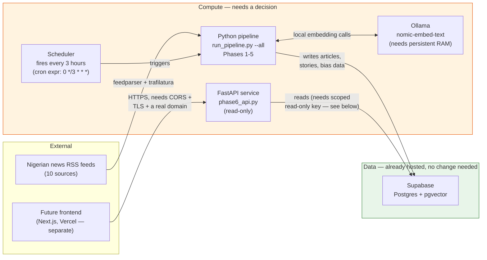
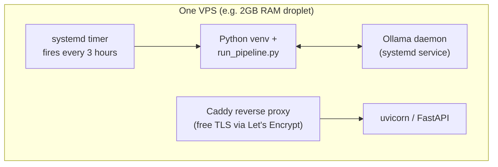
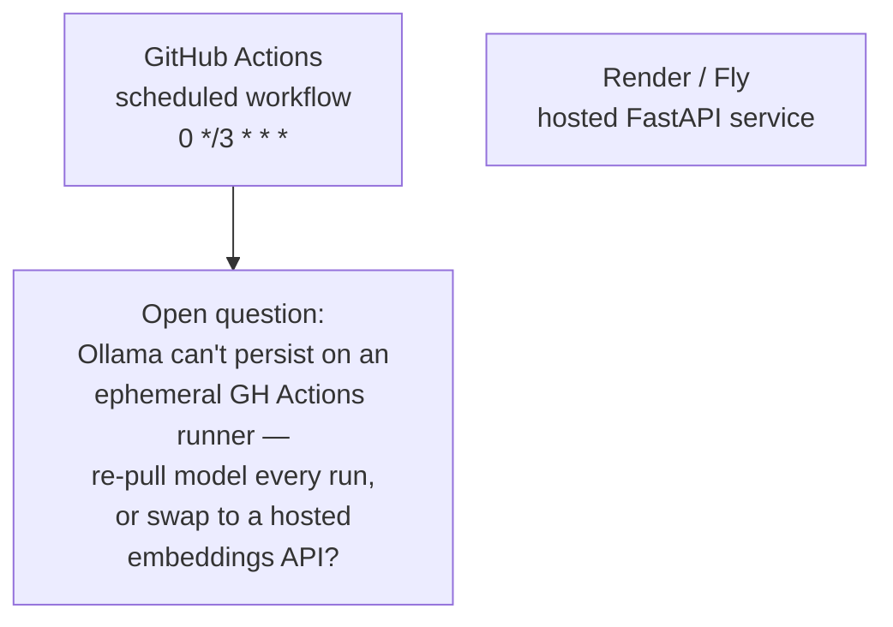

# NaijaPulse — DevOps Handoff Brief

**Purpose of this document:** give a DevOps engineer enough context to recommend and
implement real hosting for this backend — where the cron pipeline runs, where the API
lives, and how they talk to Supabase (already hosted, out of scope for this handoff).
This is a working system with real data flowing through it today, not a greenfield
design — read the "Current state" section first, it changes what's actually on the
table.

---

## Current state (today, before any hosting change)

Everything currently runs on the founder's own MacBook, invoked manually or via local
`cron`/`launchd`:

- **Ollama**, running `nomic-embed-text` locally, used for Phase 2 (embeddings)
- **Python 3 pipeline** (`naijapulse-engine/`), a chain of 5 phases: RSS ingestion →
  embedding → near-duplicate detection → clustering → bias/blindspot tagging
- **FastAPI service** (`phase6_api.py`), currently served via `uvicorn` bound to
  `localhost` only — not reachable from outside the machine
- **Supabase** (Postgres + `pgvector`) — already cloud-hosted, this does not need to
  move. Nothing in this handoff changes the database itself.

**⚠️ Known, tracked, deliberate deferral — must be resolved before any public
deployment:** Row Level Security is currently disabled on all Supabase tables, and
`phase6_api.py` authenticates with the Supabase **service-role key** (full read/write,
bypasses RLS). This was an intentional decision during active development, not an
oversight — but it is a hard blocker for exposing the API publicly. Before this API
gets a public domain, a dedicated read-only Postgres role + RLS policies + a
narrowly-scoped API key need to be in place. Full technical detail and exact SQL is in
`CODE_AUDIT.md`, Finding 2, in the same repo. **Please read that section before
touching deployment for the API specifically.**

---

## The one constraint that shapes everything: Ollama needs a persistent process

`nomic-embed-text` (the local embedding model used in Phase 2) needs a long-running
process with model weights loaded in memory — this rules out pure serverless hosting
(Vercel Functions, AWS Lambda, Cloudflare Workers) for the pipeline as it's currently
built. Any hosting recommendation needs to account for this, or propose a concrete
alternative (e.g., swapping the embedding step to a hosted embeddings API) with the
tradeoff made explicit — that would be a real architecture change from what's running
today, not just an infra choice.

---

## Architecture diagram

**What "needs a decision" means:** the Compute box above is the entire subject of this
handoff. Two candidate shapes for it are outlined below — pick one, or propose a
better one; the founder's default lean is Option A but is explicitly open to being
argued out of it.

---

## Option A — single persistent VPS (founder's working default)

- One box, one set of logs, Ollama and the pipeline talk over localhost — no network
  hop between them.
- Rough cost: $4-6/month (DigitalOcean, Hetzner, Linode — a 2GB RAM droplet class).
- The founder owns patching/monitoring/restart-on-crash for this box — this is
  explicitly the part where DevOps judgment is wanted, not a solved problem already.
- Open question for you: which provider/region, and what's the right failure-recovery
  setup (auto-restart via systemd is the baseline; is a managed uptime check /
  healthchecks.io-style dead-man's-switch worth adding for the cron specifically, so a
  silently-broken 3-hourly run gets noticed same-day rather than days later)?

## Option B — split across managed services, no server to own

- No server to patch or babysit.
- Real open problem: GitHub Actions runners are destroyed after every run, so Ollama
  and the embedding model would need to be freshly installed on every 3-hourly
  invocation — slow, and arguably defeats the reason Ollama was chosen (free, local,
  no per-call cost) over a hosted embeddings API in the first place. If you think this
  option is still worth it, the honest tradeoff (reinstall cost vs. hosted-API cost)
  needs to be laid out explicitly, not glossed over.
- Free/hobby tiers on Render and similar platforms commonly spin down after
  inactivity — first request after idle gets a cold-start delay. Fine for a demo,
  possibly not fine once a frontend depends on this API responding promptly.

---

## Specific questions for the DevOps engineer

1. Given the Ollama constraint above, do you agree Option A is the right default, or
   is there a third shape (e.g., a small persistent VM just for Ollama + the pipeline,
   with the API split onto a separate managed platform) that's actually better for
   cost/reliability at this scale?
2. What's the right way to get alerted if a scheduled pipeline run fails or simply
   doesn't happen? A silent gap in a "news every 3 hours" product is a real product
   failure, not just an infra inconvenience.
3. The scraping step (Phase 1) already has 4 of 10 Nigerian news sources actively
   blocking requests (documented in the repo's `PROGRESS.md`, "Known Gaps"). Does
   moving this traffic from a residential Nigerian IP (the founder's home connection,
   today) to a cloud VPS IP range make that better, worse, or does it need something
   specific (rotating residential proxies, different provider/region, rate limiting)
   to not regress?
4. Once RLS + a scoped read-only API key are in place (see the blocker above), what's
   the right way to issue and rotate that key, and where should it live in this
   deployment (env var via the hosting platform's secrets manager, not committed
   anywhere — flag if you see any current gaps here)?
5. CORS is not currently configured on the FastAPI service at all — once a frontend
   on a different origin (e.g. Vercel) needs to call this API, what's the right CORS
   policy, and should that live in FastAPI itself or at the reverse-proxy layer?

---

## Explicitly out of scope for this handoff

- The Supabase database itself — already hosted, not moving.
- Frontend hosting (Next.js) — separate, likely Vercel, not this engineer's concern
  unless CORS/API-contract questions come up.
- Any further Phase 1-5 pipeline logic changes — those are application-level, tracked
  separately in `CODE_AUDIT.md`.
